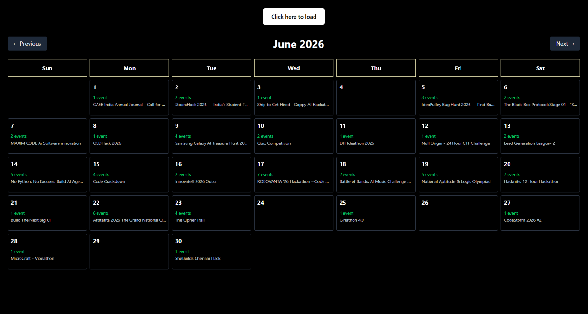

# scrappy



`scrappy` is a React + Vite client for browsing hackathon events in a monthly calendar view. It loads event data from an API, groups events by registration start date, and shows details for the selected day.

## Features

- Monthly calendar UI for browsing events
- Previous / next month navigation
- Day cells that show event counts and a preview title
- Detail panel for the selected date
- Manual reload button for refreshing event data
- Event details including:
  - name
  - logo
  - location
  - paid / free status
  - registration start and end dates
  - team size range
  - skills
  - external event link

## Tech stack

- React 19
- Vite 8
- Tailwind CSS 4
- Oxlint

## Project structure

```text
scrappy-client/
├─ src/
│  ├─ App.jsx      # calendar UI and event fetching
│  ├─ App.css
│  ├─ index.css
│  └─ main.jsx     # React entry point
├─ image.png       # README preview image
├─ index.html
├─ package.json
└─ vite.config.js  # Vite config with /api proxy
```

## Data source

The UI expects a backend API that exposes:

```text
GET /api/hacks/live
```

The app expects a JSON response shaped like:

```json
{
  "success": true,
  "data": []
}
```

Event objects may include fields such as:

- `evnt_name`
- `logo_url`
- `location`
- `paid`
- `reg_started`
- `reg_ended`
- `min_team_size`
- `max_team_size`
- `skills`
- `site`

## Running the app

### 1. Install dependencies

```bash
npm install
```

### 2. Start the frontend

```bash
npm run dev
```

This starts the Vite development server.

## API configuration

The current frontend uses two request styles:

- On initial page load, it fetches from:

  ```text
  ${VITE_API_URL}/api/hacks/live
  ```

- The manual reload button fetches from:

  ```text
  /api/hacks/live
  ```

Vite is configured to proxy `/api` requests to `http://localhost:8001` during development.

If you want the initial page load to work in development, create a `.env` file with:

```env
VITE_API_URL=http://localhost:8001
```

## Available scripts

```bash
npm run dev         # start the Vite dev server
npm run build       # create a production build
npm run preview     # preview the production build
npm run lint        # run oxlint
npm run start       # tries to run index.js
npm run dev-server  # tries to run index.js with nodemon
```

## Current repository note

`package.json` still includes backend-oriented scripts (`start` and `dev-server`), but there is no checked-in `index.js` server file in the current repository snapshot.

That means this repo currently contains the client application, plus configuration for talking to an API, but not the backend implementation itself.

## Current behavior

- The app loads event data into local React state
- Events are placed on the calendar using `reg_started`
- Clicking a day shows the events for that date
- The selected day displays a detail panel below the calendar
- The reload button can be used to re-fetch data

## Notes

- Development proxying is configured in `vite.config.js`
- Tailwind is imported directly in `src/index.css`
- The UI currently assumes the API is reachable locally during development unless you point `VITE_API_URL` elsewhere
